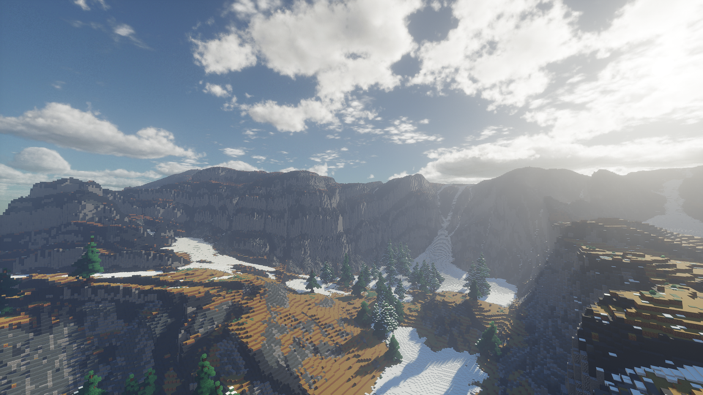

# Derivative

This is a long-term project, as well as my first Minecraft shaderpack. 
It aims to provide excellent image quality while maintaining good performance.

### Special Thanks:
* qwertyuiop(moyongxin) - Technical guidance
* GeForceLegend - Technical guidance
* Yi-Meng - Propaganda
* factorization - Propaganda
