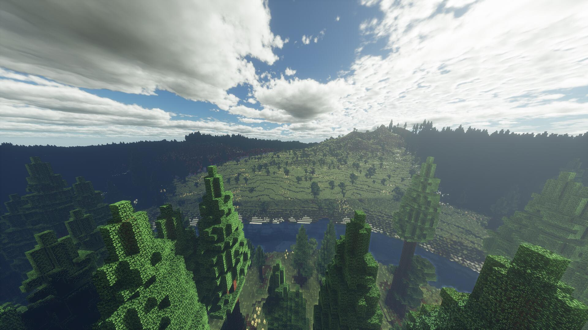

# Derivative (Voxy 适配版)

本项目完成了对 Derivative 光影的 Voxy 模组原生适配。

### 主要工作：
**Voxy 兼容性构建**：补齐了 Voxy 所需的 `voxy.json` 协议及 G-Buffer 注入代码。
### 对比效果：
| 原版 (不适配 Voxy) | 修改版 (适配 Voxy) |
| :---: | :---: |
|  |  |

### 特别鸣谢：
Derivative的开发者们
